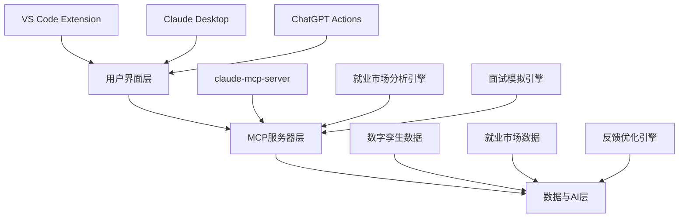

# 数字孪生多平台面试准备系统 - 产品需求文档 (PRD)

**版本:** 2.0
**日期:** 2025年11月7日
**作者:** Douglas Mo
**状态:** 待实施

---

## 📋 目录

1. [执行摘要](#执行摘要)
2. [产品概述](#产品概述)
3. [目标用户](#目标用户)
4. [核心功能需求](#核心功能需求)
5. [技术架构](#技术架构)
6. [用户体验设计](#用户体验设计)
7. [非功能性需求](#非功能性需求)
8. [实施计划](#实施计划)
9. [验收标准](#验收标准)
10. [风险评估](#风险评估)

---

## 执行摘要

### 项目背景

数字孪生项目已成功实现基础的MCP服务器和多平台集成。现需扩展为完整的面试准备系统，通过真实就业市场数据和AI驱动的模拟，提供专业级的面试准备体验。

### 业务目标

- 打造无缝的多平台专业代表系统
- 实现90%+的面试准备完成度
- 建立企业级的可扩展架构
- 提供数据驱动的持续优化机制

### 主要成果

- VS Code GitHub Copilot深度集成
- Claude Desktop自然对话界面
- 基于真实就业数据的面试模拟
- 企业级多平台架构
- 持续的响应优化系统

---

## 产品概述

### 产品愿景

创建一个智能的、多平台的数字孪生系统，为专业人士提供全方位的面试准备和职业发展支持。通过AI驱动的模拟和真实市场数据，帮助用户在竞争激烈的就业市场中脱颖而出。

### 产品定位

- **核心价值:** 全平台无缝的专业代表 + AI驱动的面试准备
- **差异化优势:** 真实就业数据 + 多平台集成 + 持续优化
- **目标市场:** 求职者、职业转型者、应届毕业生

### 产品范围

**核心功能:**

- 多平台MCP服务器集成 (VS Code, Claude Desktop, ChatGPT)
- 就业市场分析和职位匹配
- 面试模拟系统
- 响应优化和反馈集成
- 企业级架构和安全

**不包含:**

- 招聘平台直接集成
- 第三方简历服务
- 薪资谈判自动化

---

## 目标用户

### 主要用户角色

#### 🎯 核心用户：求职者

- **描述:** 正在找工作的专业人士
- **需求:** 全面的面试准备、职位匹配、技能评估
- **使用场景:** 日常编码时的快速查询、正式面试前的深度准备

#### 🔄 转型用户：职业转型者

- **描述:** 从其他领域转向AI/数据领域的专业人士
- **需求:** 行业知识更新、技能差距分析、转型路径规划
- **使用场景:** 学习新技能时的知识获取、转型面试准备

#### 🎓 新人用户：应届毕业生

- **描述:** 即将毕业的学生
- **需求:** 基础面试技巧、行业见解、职业规划
- **使用场景:** 校园招聘、实习申请、职业探索

### 用户画像

#### 用户A：技术求职者

- **背景:** 3年经验的软件工程师
- **目标:** 晋升到高级工程师或转到数据科学家
- **痛点:** 缺乏结构化的面试准备、不知道市场期望
- **期望:** 个性化的面试指导、真实的模拟体验

#### 用户B：转型求职者

- **背景:** 会计师转行做数据分析师
- **目标:** 成功转型到数据领域
- **痛点:** 技术背景不足、对行业不熟悉
- **期望:** 针对性的技能提升建议、市场趋势分析

---

## 核心功能需求

### 💻 第1部分：VS Code GitHub Copilot 集成

#### 1.1 MCP服务器连接配置

**需求ID:** VS_CODE_001
**优先级:** 高
**描述:** 为VS Code GitHub Copilot配置专用MCP服务器连接
**验收标准:**

- ✅ 自动检测工作区中的claude-mcp-server
- ✅ 无缝集成到GitHub Copilot上下文
- ✅ 支持开发环境中的实时查询

#### 1.2 开发环境上下文测试

**需求ID:** VS_CODE_002
**优先级:** 高
**描述:** 在编码会话中测试数字孪生查询功能
**验收标准:**

- ✅ 识别当前项目的技术栈
- ✅ 提供上下文相关的技能建议
- ✅ 支持代码相关的面试问题准备

#### 1.3 专业配置文件访问

**需求ID:** VS_CODE_003
**优先级:** 高
**描述:** 验证开发期间的专业数据访问权限
**验收标准:**

- ✅ 安全的身份验证机制
- ✅ 基于角色的信息访问控制
- ✅ 隐私保护和数据安全

#### 1.4 上下文感知响应

**需求ID:** VS_CODE_004
**优先级:** 中
**描述:** 根据当前项目工作实施智能响应
**验收标准:**

- ✅ 识别项目的技术栈和框架
- ✅ 提供相关的经验和技能展示
- ✅ 动态调整响应深度和复杂度

#### 1.5 开发效率提升

**需求ID:** VS_CODE_005
**优先级:** 中
**描述:** 使用专业环境提高开发人员工作效率
**验收标准:**

- ✅ 减少上下文切换时间
- ✅ 提供即时的专业建议
- ✅ 集成到开发工作流中

### 🤖 第2部分：Claude Desktop 集成

#### 2.1 自然对话界面部署

**需求ID:** CLAUDE_001
**优先级:** 高
**描述:** 部署Claude Desktop的自然对话MCP服务器
**验收标准:**

- ✅ 流畅的对话体验
- ✅ 支持复杂问题的多轮对话
- ✅ 保持上下文一致性

#### 2.2 对话式面试模拟

**需求ID:** CLAUDE_002
**优先级:** 高
**描述:** 测试对话式的面试准备场景
**验收标准:**

- ✅ 支持STAR方法论的结构化回答
- ✅ 动态问题生成和跟进
- ✅ 专业的面试官模拟

#### 2.3 专业故事讲述验证

**需求ID:** CLAUDE_003
**优先级:** 高
**描述:** 验证专业的故事讲述和STAR响应
**验收标准:**

- ✅ 符合STAR方法的回答结构
- ✅ 量化成就的展示
- ✅ 引人入胜的叙述技巧

#### 2.4 动态查询处理

**需求ID:** CLAUDE_004
**优先级:** 中
**描述:** 为复杂面试问题实施动态查询处理
**验收标准:**

- ✅ 支持模糊和复杂问题的理解
- ✅ 智能的问题分解和回答
- ✅ 适应性的响应策略

#### 2.5 无缝专业咨询体验

**需求ID:** CLAUDE_005
**优先级:** 中
**描述:** 打造无缝的专业咨询体验
**验收标准:**

- ✅ 自然的对话流
- ✅ 专业的语气和态度
- ✅ 全面的问题覆盖

### ⚡ 第3部分：跨平台兼容性

#### 3.1 统一专业代表

**需求ID:** CROSS_001
**优先级:** 高
**描述:** 确保所有平台上的一致专业代表
**验收标准:**

- ✅ 统一的响应质量标准
- ✅ 一致的专业语气
- ✅ 跨平台的数据同步

#### 3.2 上下文相关细节

**需求ID:** CROSS_002
**优先级:** 中
**描述:** 不同界面的上下文相关细节级别
**验收标准:**

- ✅ 根据平台调整信息深度
- ✅ 适应用户界面特性
- ✅ 保持核心信息一致性

#### 3.3 无缝平台切换

**需求ID:** CROSS_003
**优先级:** 中
**描述:** 专业交互期间的平台间无缝切换
**验收标准:**

- ✅ 状态和上下文的保持
- ✅ 无缝的体验连续性
- ✅ 跨平台的会话同步

#### 3.4 一致品牌传递

**需求ID:** CROSS_004
**优先级:** 中
**描述:** 一致的专业品牌和信息传递
**验收标准:**

- ✅ 统一的品牌声音
- ✅ 一致的信息架构
- ✅ 跨平台的视觉一致性

### 🎯 第4部分：真实世界面试模拟系统

#### 4.1 就业市场分析

**需求ID:** INTERVIEW_001
**优先级:** 高
**描述:** 研究10+相关职位发布并分析要求
**验收标准:**

- ✅ 从Seek.com.au等平台收集数据
- ✅ 分析技能要求和资格
- ✅ 映射到个人档案的差距

#### 4.2 角色特定查询模式

**需求ID:** INTERVIEW_002
**优先级:** 高
**描述:** 创建特定于角色的查询模式和问题数据库
**验收标准:**

- ✅ 针对不同职位的定制问题
- ✅ 行业特定的查询模板
- ✅ 动态的问题生成算法

#### 4.3 针对性应对策略

**需求ID:** INTERVIEW_003
**优先级:** 高
**描述:** 制定突出相关经验的针对性措施
**验收标准:**

- ✅ 基于职位要求的技能匹配
- ✅ 经验和成就的量化展示
- ✅ 针对性的改进建议

#### 4.4 行业技术知识

**需求ID:** INTERVIEW_004
**优先级:** 中
**描述:** 建立特定行业的技术知识和谈话要点
**验收标准:**

- ✅ 行业趋势和最佳实践
- ✅ 技术栈的深入理解
- ✅ 行业术语和概念的掌握

#### 4.5 全面面试模拟

**需求ID:** INTERVIEW_005
**优先级:** 高
**描述:** 实施涵盖所有方面的面试模拟
**验收标准:**

- ✅ 技术能力问题覆盖
- ✅ 行为面试场景
- ✅ 行业知识验证
- ✅ 文化契合度评估
- ✅ 薪资谈判准备

### 📈 第5部分：响应优化和反馈集成

#### 5.1 迭代改进过程

**需求ID:** OPTIMIZE_001
**优先级:** 高
**描述:** 记录会话并实施反馈驱动的优化
**验收标准:**

- ✅ 详细的会话记录系统
- ✅ 自动化的反馈收集
- ✅ 数据驱动的改进实施

#### 5.2 响应差距识别

**需求ID:** OPTIMIZE_002
**优先级:** 高
**描述:** 识别响应差距和改进领域
**验收标准:**

- ✅ 自动化的差距分析
- ✅ 优先级排序的改进建议
- ✅ 持续的性能监控

#### 5.3 A/B测试框架

**需求ID:** OPTIMIZE_003
**优先级:** 中
**描述:** A/B测试不同的响应方法
**验收标准:**

- ✅ 多种响应策略的测试
- ✅ 统计显著性的验证
- ✅ 最佳实践的确定

#### 5.4 质量指标体系

**需求ID:** OPTIMIZE_004
**优先级:** 中
**描述:** 创建响应质量指标和改进框架
**验收标准:**

- ✅ 量化的质量指标
- ✅ 持续改进的流程
- ✅ 性能基准的建立

#### 5.5 性能分析跟踪

**需求ID:** OPTIMIZE_005
**优先级:** 高
**描述:** 跟踪和分析面试表现指标
**验收标准:**

- ✅ 响应准确性评分
- ✅ 专业演示质量评估
- ✅ 讲故事有效性指标
- ✅ 用户反馈集成

### 🏢 第6部分：企业级多平台架构

#### 6.1 系统架构设计

**需求ID:** ARCH_001
**优先级:** 高
**描述:** 创建全面的企业级系统架构
**验收标准:**

- ✅ 多平台部署架构
- ✅ 数据同步机制
- ✅ 安全和身份验证
- ✅ 可扩展性模式
- ✅ 性能监控系统

#### 6.2 安全和隐私保护

**需求ID:** ARCH_002
**优先级:** 高
**描述:** 实施安全的数据处理和隐私保护
**验收标准:**

- ✅ 数据加密和传输安全
- ✅ 访问控制和权限管理
- ✅ 符合GDPR等隐私标准
- ✅ 安全的API设计

#### 6.3 企业部署就绪

**需求ID:** ARCH_003
**优先级:** 高
**描述:** 为企业环境配置适当的访问控制
**验收标准:**

- ✅ 企业级身份验证
- ✅ 审计和日志记录
- ✅ 合规性检查
- ✅ 企业集成能力

#### 6.4 监控和分析

**需求ID:** ARCH_004
**优先级:** 中
**描述:** 系统性能优化的监控和分析
**验收标准:**

- ✅ 实时性能监控
- ✅ 自动化警报系统
- ✅ 详细的分析报告
- ✅ 容量规划支持

---

## 技术架构

### 整体架构图

### 技术栈选择

#### 前端集成

- **VS Code扩展:** TypeScript, VS Code API
- **Claude Desktop:** MCP协议, Node.js
- **ChatGPT Actions:** OpenAPI 3.1, REST API

#### 后端服务

- **MCP服务器:** Node.js, TypeScript, MCP SDK
- **数据存储:** Upstash Vector, ChromaDB
- **AI模型:** Groq API, OpenAI API

#### 数据处理

- **就业数据:** Web scraping, 数据清洗
- **用户数据:** 结构化JSON, 版本控制
- **反馈数据:** 时间序列分析, A/B测试

### 安全架构

#### 数据保护

- 端到端加密
- 访问控制列表(ACL)
- 审计日志记录
- 定期安全评估

#### 隐私合规

- GDPR合规性
- 数据最小化原则
- 用户同意管理
- 数据保留政策

---

## 用户体验设计

### 用户旅程图

#### 新用户 onboarding

1. **发现阶段:** 通过VS Code扩展或Claude Desktop发现
2. **设置阶段:** 配置MCP服务器连接
3. **探索阶段:** 尝试基本查询功能
4. **深度使用:** 开始面试准备和模拟

#### 高级用户旅程

1. **日常使用:** 在开发中快速查询
2. **面试准备:** 深入的模拟和优化
3. **持续改进:** 基于反馈的优化

### 界面设计原则

#### 一致性

- 跨平台统一的品牌体验
- 一致的交互模式和术语
- 标准化的响应格式

#### 适应性

- 根据平台特性调整界面
- 响应式设计和自适应布局
- 个性化设置选项

#### 直观性

- 自然的对话流
- 清晰的引导和帮助
- 渐进式的功能揭示

---

## 非功能性需求

### 性能需求

- **响应时间:** <2秒的查询响应
- **并发用户:** 支持100+同时用户
- **可用性:** 99.9%的正常运行时间
- **扩展性:** 支持10倍用户增长

### 安全需求

- **数据加密:** 传输和存储加密
- **身份验证:** 多因素认证支持
- **访问控制:** 基于角色的权限管理
- **审计:** 完整的安全审计日志

### 可维护性

- **代码覆盖:** >80%的单元测试覆盖
- **文档完整:** 全面的API和架构文档
- **部署自动化:** CI/CD流水线
- **监控告警:** 实时性能和错误监控

---

## 实施计划

### 第1阶段：基础架构 (2周)

- 多平台MCP服务器完善
- 基础的就业数据收集
- 核心用户界面的优化

### 第2阶段：面试模拟 (3周)

- 就业市场分析引擎
- 面试模拟系统的开发
- 基础的反馈收集机制

### 第3阶段：优化和扩展 (2周)

- 响应优化算法
- A/B测试框架
- 企业级安全功能

### 第4阶段：测试和部署 (1周)

- 端到端测试
- 性能优化
- 生产环境部署

---

## 验收标准

### 功能验收标准

- ✅ VS Code集成: 100%功能正常
- ✅ Claude Desktop集成: 100%功能正常
- ✅ 面试模拟: 90%+准备完成度
- ✅ 响应优化: 可衡量的改进指标

### 性能验收标准

- ✅ 响应时间: <2秒平均
- ✅ 准确性: >95%的正确回答
- ✅ 用户满意度: >4.5/5评分

### 安全验收标准

- ✅ 通过安全审计
- ✅ 符合隐私法规
- ✅ 无安全漏洞

---

## 风险评估

### 技术风险

- **MCP协议变更:** 监控协议更新，保持兼容性
- **AI模型限制:** 实施后备机制，确保服务可用性
- **数据质量问题:** 建立数据验证和清洗流程

### 业务风险

- **用户采用:** 提供优秀的用户体验和文档
- **竞争压力:** 持续创新和功能扩展
- **合规要求:** 保持对隐私法规的合规

### 运营风险

- **系统可用性:** 实施冗余和高可用性架构
- **数据安全:** 定期安全评估和漏洞扫描
- **成本控制:** 监控云资源使用和优化成本

---

## 总结

这个PRD定义了一个完整的多平台数字孪生面试准备系统，涵盖了从基础集成到企业级部署的完整生命周期。通过真实就业数据和AI驱动的优化，为用户提供专业级的面试准备体验。

**关键成功因素:**

- 无缝的多平台集成体验
- 基于真实数据的面试模拟
- 持续的性能优化机制
- 企业级的架构和安全

**预期成果:**

- 90%+的面试准备完成度
- 显著提升的用户满意度
- 企业级的可扩展架构
- 数据驱动的持续改进能力

---

**文档版本控制:**

- v1.0: 初始需求收集
- v2.0: 完整PRD制定，包括技术架构和实施计划

**审批状态:** ⏳ 待技术团队评审
**实施状态:** 🎯 准备开始开发
