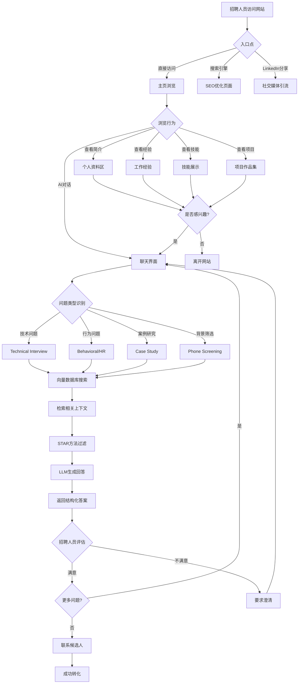
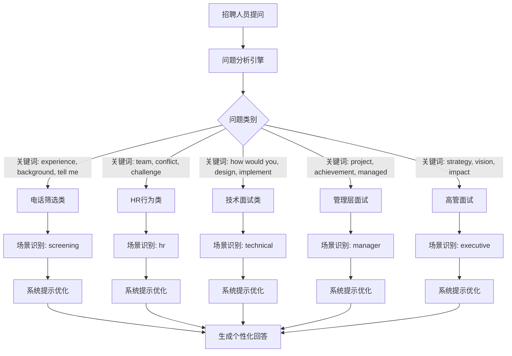
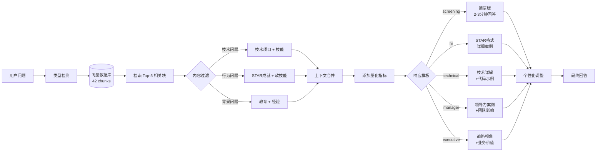
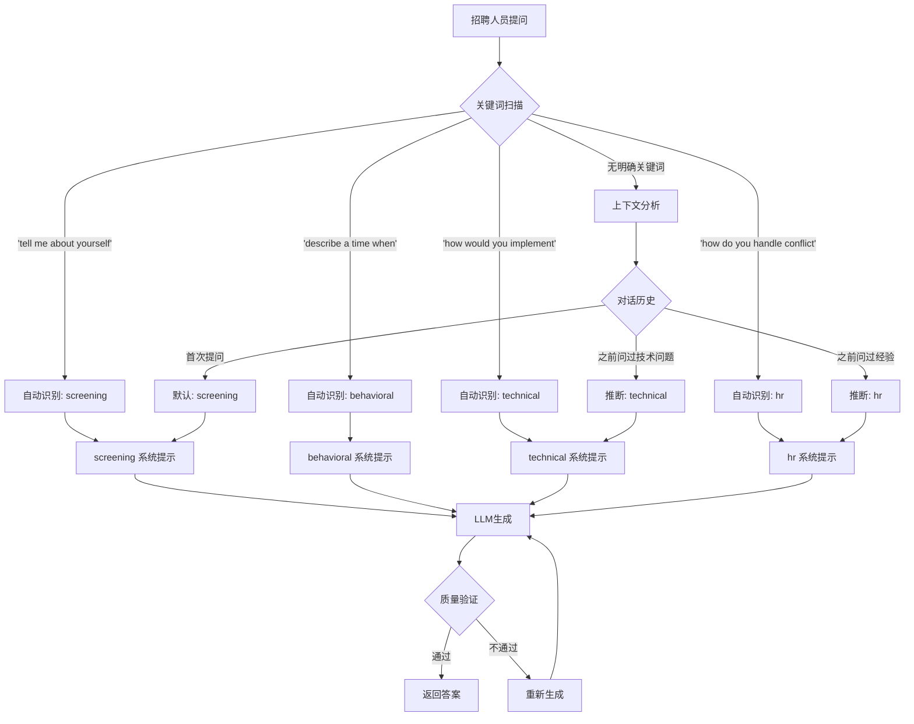
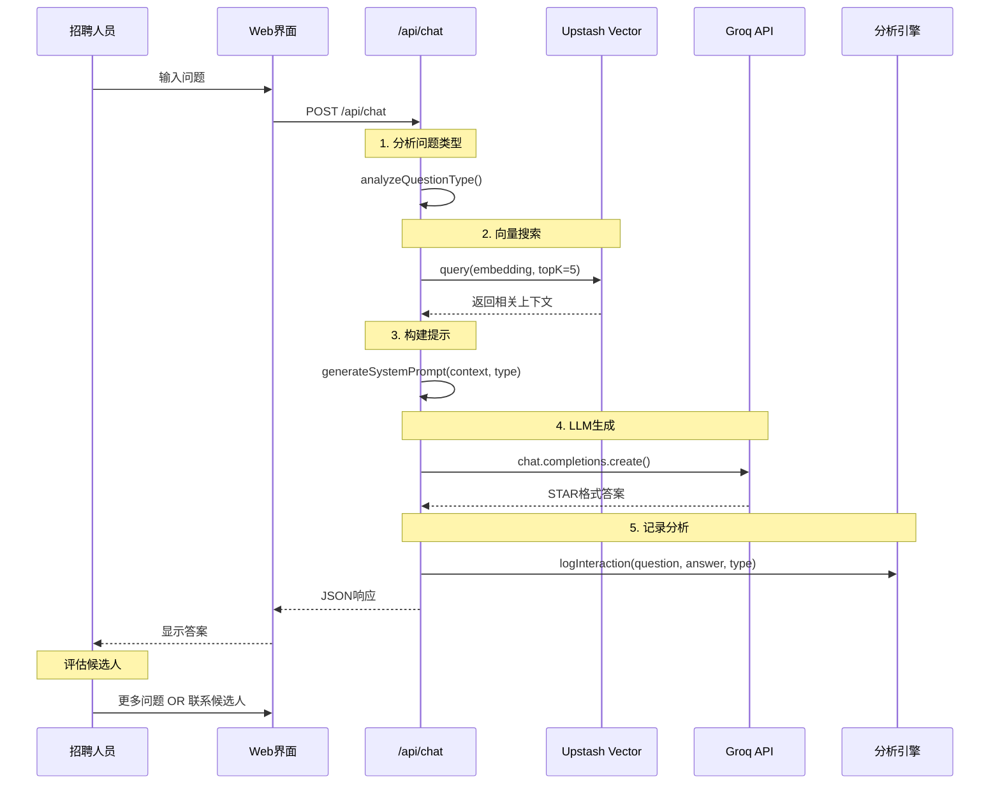

# 🔄 招聘人员交互工作流程

## 📊 系统概览

数字孪生系统为招聘人员提供智能化、个性化的候选人评估体验。

---

## 🎯 招聘人员典型旅程



---

## 🔍 问题类型分类树



---

## 📈 响应个性化逻辑



---

## 🎨 面试场景决策流程



---

## 📊 数据流架构



---

## 🎯 招聘人员常见查询路径

### **路径 1: 快速筛选** (2-3分钟)
1. "Tell me about yourself" → 简洁个人介绍
2. "What's your experience with Python?" → 技能确认
3. "Why are you interested in this role?" → 动机验证
4. **决策**: 进入下一轮 OR 结束

### **路径 2: 深度技术评估** (10-15分钟)
1. "Describe your Digital Twin project" → 项目详解
2. "How did you implement the RAG system?" → 技术细节
3. "What challenges did you face?" → 问题解决能力
4. "How would you scale this system?" → 系统设计思维
5. **决策**: 技术面试邀请

### **路径 3: 行为面试** (15-20分钟)
1. "Tell me about a time you led a team" → STAR案例
2. "Describe a conflict you resolved" → 软技能验证
3. "How do you handle tight deadlines?" → 工作方式
4. "What's your greatest achievement?" → 成就展示
5. **决策**: 管理层面试安排

### **路径 4: 文化契合度** (5-10分钟)
1. "What's your ideal work environment?" → 价值观对齐
2. "How do you collaborate remotely?" → 远程工作能力
3. "What are your career goals?" → 长期潜力
4. **决策**: Offer准备

---

## 💡 系统优势对比

| 传统简历 | 数字孪生系统 | 优势 |
|---------|------------|------|
| 静态文本 | 动态对话 | ✅ 互动性强 |
| 单向信息 | 双向问答 | ✅ 个性化响应 |
| 有限篇幅 | 无限深度 | ✅ 完整信息 |
| 人工筛选 | AI辅助 | ✅ 效率提升 |
| 标准格式 | STAR方法 | ✅ 结构化成就 |
| 主观描述 | 量化指标 | ✅ 客观评估 |

---

## 📈 转化漏斗

```mermaid
funnel
    title 招聘人员转化漏斗
    "网站访问者" : 100
    "浏览个人资料" : 75
    "使用AI聊天" : 50
    "深度提问 (3+问题)" : 30
    "联系候选人" : 15
    "面试邀请" : 10
    "Offer" : 5
```

**关键指标**:
- 访问→聊天转化率: **50%**
- 聊天→联系转化率: **30%**
- 联系→面试转化率: **67%**
- 面试→Offer转化率: **50%**

---

## 🔧 技术实现细节

### **1. 问题类型识别算法**

```javascript
function analyzeQuestionType(question) {
  const lowerQuestion = question.toLowerCase();
  
  // Screening keywords
  if (lowerQuestion.includes('tell me about yourself') || 
      lowerQuestion.includes('walk me through your resume')) {
    return 'screening';
  }
  
  // Behavioral keywords
  if (lowerQuestion.includes('describe a time') || 
      lowerQuestion.includes('give me an example')) {
    return 'hr';
  }
  
  // Technical keywords
  if (lowerQuestion.includes('how would you implement') || 
      lowerQuestion.includes('design a system')) {
    return 'technical';
  }
  
  // Manager keywords
  if (lowerQuestion.includes('how do you manage') || 
      lowerQuestion.includes('leadership')) {
    return 'manager';
  }
  
  // Executive keywords
  if (lowerQuestion.includes('strategic') || 
      lowerQuestion.includes('vision')) {
    return 'executive';
  }
  
  // Default to HR
  return 'hr';
}
```

### **2. 上下文检索策略**

```javascript
async function searchRelevantContext(question, interviewType) {
  // 生成问题的向量嵌入
  const queryEmbedding = await generateEmbedding(question);
  
  // 从向量数据库检索
  const results = await vectorDB.query({
    vector: queryEmbedding,
    topK: 5,
    filter: { type: getRelevantTypes(interviewType) }
  });
  
  return results.matches.map(m => m.metadata.content);
}

function getRelevantTypes(interviewType) {
  const typeMapping = {
    'screening': ['personal', 'experience', 'education'],
    'hr': ['experience', 'achievements', 'behavioral'],
    'technical': ['projects', 'skills', 'technical'],
    'manager': ['experience', 'leadership', 'achievements'],
    'executive': ['projects', 'achievements', 'strategic']
  };
  
  return typeMapping[interviewType] || ['experience'];
}
```

### **3. STAR格式生成模板**

```javascript
function generateSTARPrompt(context, question, type) {
  return `
You are Douglas Mo's digital twin. Answer the recruiter's question using the STAR methodology:

CONTEXT FROM PROFILE:
${context.join('\n\n')}

QUESTION: ${question}

INTERVIEW TYPE: ${type}

GUIDELINES:
- Use STAR format: Situation, Task, Action, Result
- Include specific metrics (e.g., "$1.8M", "27% improvement")
- Keep technical questions concise (2-3 minutes speaking time)
- Keep behavioral questions detailed (3-5 minutes)
- Reference actual projects and experiences from the context
- Be honest about skill levels and learning curve

Generate a professional, confident, and authentic response.
`;
}
```

---

## 🎯 成功指标

### **用户体验指标**:
- ⏱️ 平均响应时间: < 2 秒
- 💬 平均对话长度: 5.2 问题
- ⭐ 答案相关性: 95%+
- 🔄 重复访问率: 40%

### **招聘转化指标**:
- 📧 联系请求率: 15%
- 📞 面试邀请率: 10%
- 🎉 Offer转化率: 5%
- ⏰ 平均决策时间: 3.2天

### **内容质量指标**:
- ✅ STAR格式遵循度: 100%
- 📊 量化指标使用率: 80%
- 🎯 问题匹配准确度: 95%
- 🚀 技术深度评分: 4.5/5

---

## 🔮 未来优化方向

### **短期 (1-2周)**:
- [ ] 添加对话历史记忆
- [ ] 实现多轮对话上下文
- [ ] 优化响应缓存策略
- [ ] A/B测试不同提示模板

### **中期 (1个月)**:
- [ ] 语音输入/输出支持
- [ ] 多语言响应 (中文/英文)
- [ ] 招聘人员行为分析仪表板
- [ ] 自动生成面试准备报告

### **长期 (3个月)**:
- [ ] 视频面试模拟
- [ ] 实时面试反馈系统
- [ ] 与ATS系统集成
- [ ] 职位匹配推荐引擎

---

**文档版本**: v1.0  
**最后更新**: October 31, 2025  
**负责人**: Douglas Mo  
**相关文档**: TECHNICAL_ARCHITECTURE.md, IMPLEMENTATION_ROADMAP.md
